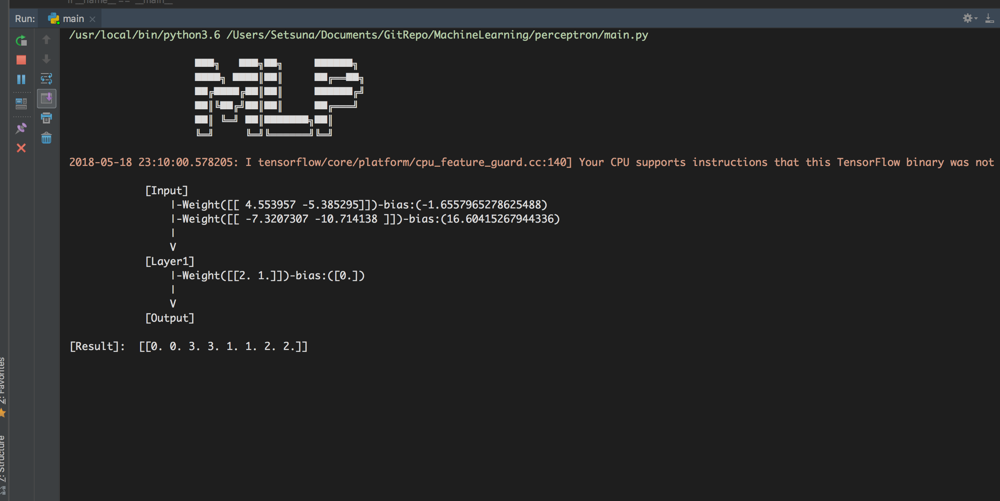
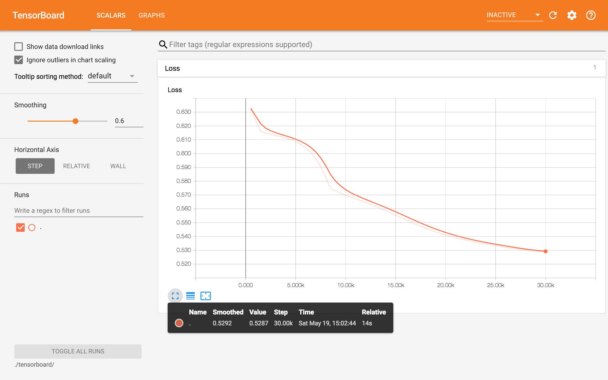
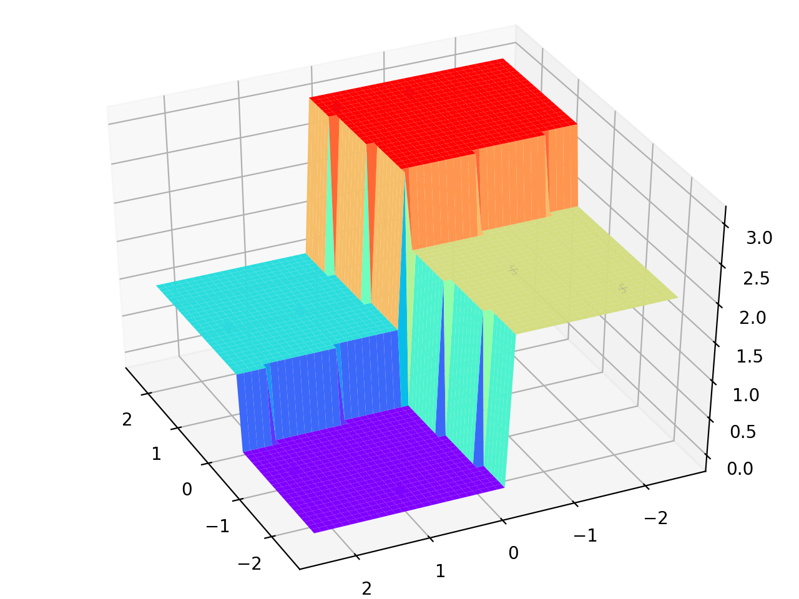

### 程序说明

---

#### 1. 工具包清单

- tensorflow
- numpy
- matplotlib.pyplot

#### 2. 模块功能

> MPL类（main.py)

```python
# 网络参数
self.learning_rate = 0.001  # 学习率
self.max_iter = 10000  # 最大迭代次数
self.n_hidden_1 = 1  # 第一层神经元个数
self.n_input = 2  # 样本特征数
# 定义权值和偏置
self.Weights = {
	'h1': tf.Variable(tf.random_normal([self.n_input, self.n_hidden_1]), name='layer1_w'),
	'out': tf.Variable(tf.random_normal([self.n_hidden_1, 1]), dtype=tf.float32)
}
self.biases = {
	'h1': tf.Variable(tf.zeros([1, self.n_hidden_1]), name='layer1_bias'),
	'out': tf.constant(0.)
}
self.model_path = "./model/model.ckpt"  # 模型保存路径
self.names = ['h1', 'out']  # 便与遍历
```

```python
def __add_layer__(self, name, inputs, activation_function=None):
    """
    添加一个神经网络层
    :param inputs: 输入数据
    :param activation_function: 激活函数
    :return: 该层输出
    """
    pass
```

```python
def fit(self, X_train, y_train):
    """
    训练分类器
    :param X_train:训练样本
    :param y_train:训练标签
    :return:
    """
    pass
```

```python
def get_params(self):
    """
    输出网络参数
    :return: 权值，偏置
    """
    pass
```

```python
def predict(self, X_test):
    """
    使用模型预测
    :param X_test: 测试数据
    :return: 预测结果
    """
    pass
```

```python
def hardlim(x):
    """
    硬极限函数
    :param x: 数组
    :return: 数组
    """
    pass
```

```python
def draw(weight, bias):
    """
    可视化结果
    :param weight: 网络权值矩阵
    :param bias: 网络偏置矩阵
    :return:
    """
    pass
```


### 运行结果

---





