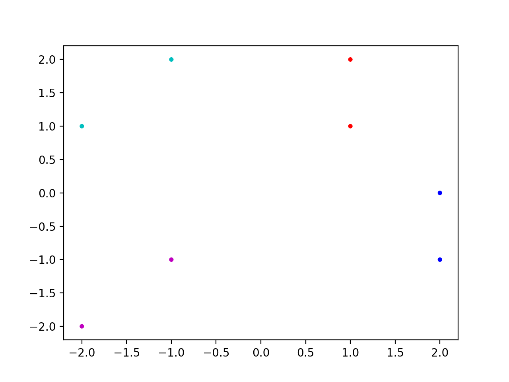

 <center><font size=72>机器学习大作业</font></center>


|     题目     | 多层感知器网络  |
| :----------: | :-------------: |
|   **姓名**   |   **鲍超俊**    |
|   **学号**   | **15020510059** |
| **指导老师** |   **杨淑媛**    |

<div style="page-break-after:always;"></div>

### 一、感知器算法

---

#### 1 算法简介

&emsp;&emsp;感知器是Frank Rosenblatt在1957年就职于康奈尔航空实验室时所发明的一种人工神经网络。它可以被视为一种最简单形式的前馈神经网络，是一种二元线性分类器。

&emsp;&emsp;Frank Rosenblatt给出了相应的感知机学习算法，常用的有感知机学习、最小二乘法和梯度下降法。譬如，感知机利用梯度下降法对损失函数进行极小化，求出可将训练数据进行线性划分的分离超平面，从而求得感知机模型。


#### 2. 感知器模型

##### 2.1 问题描述

&emsp;&emsp;已知$m$个样本，每个样本对应于$n$维特征和一个二元类别输出，如下：
$$
(x_1^{(0)}, x_2^{(0)}, ...x_n^{(0)}, y_0), (x_1^{(1)}, x_2^{(1)}, ...x_n^{(1)},y_1), ... (x_1^{(m)}, x_2^{(m)}, ...x_n^{(m)}, y_n)
$$
求超平面$\theta_0 + \theta_{1}x_1 + ... + \theta_{n}x_{n}=0$让其中一种类别的样本都满足$\theta_0 + \theta_{1}x_1 + ... + \theta_{n}x_{n} > 0$，让另一种类别的样本都满足$\theta_0 + \theta_{1}x_1 + ... + \theta_{n}x_{n} < 0$。

##### 2.2 优化目标

&emsp;&emsp;不妨定义损失函数如下：


$$
J(\theta) = - \sum\limits_{x_i \in M}y^{(i)}\theta \cdot x^{(i)}
$$

#### 3. 优化过程

&emsp;&emsp;感知器模型选择的是采用随机梯度下降法，即每次只用一个误分类的样本来计算梯度，假设采用第$i$个样本来更新梯度，则简化后的$\theta$向量的梯度下降迭代公式为：
$$
\theta = \theta  + \alpha y^{(i)}x^{(i)}
$$

其中$α$为步长，$y^{(i)}$为样本输出1或者-1，$x^{(i)}$为$(n+1) \times 1$的向量。 


### 二、感知器网络设计

---

&emsp;&emsp;训练数据分布如下图所示，由此可得网络至少需要三个神经元（感知器），共两层隐藏层。样本经过第一隐藏层两个神经元处理，输出两位二进制数，共4中状态。第二隐藏层神经元将这四种状态映射到四个类别标签，实现四分类。



### 三、实验结果

---

#### 1. 控制台输出结果


#### 2. 损失函数优化曲线


#### 3. 可视化结果


### 三、程序说明

---

> 项目文件已开源至Github: 

#### 1. 工具包清单

 + tensorflow
 + numpy
 + matplotlib.pyplot

#### 2. 模块功能

> MPL类（main.py)

```python 
# 网络参数
self.learning_rate = 0.001  # 学习率
self.max_iter = 10000  # 最大迭代次数
self.n_hidden_1 = 1  # 第一层神经元个数
self.n_input = 2  # 样本特征数
# 定义权值和偏置
self.Weights = {
	'h1': tf.Variable(tf.random_normal([self.n_input, self.n_hidden_1]), name='layer1_w'),
	'out': tf.Variable(tf.random_normal([self.n_hidden_1, 1]), dtype=tf.float32)
}
self.biases = {
	'h1': tf.Variable(tf.zeros([1, self.n_hidden_1]), name='layer1_bias'),
	'out': tf.constant(0.)
}
self.model_path = "./model/model.ckpt"  # 模型保存路径
self.names = ['h1', 'out']  # 便与遍历
```

```python
def __add_layer__(self, name, inputs, activation_function=None):
    """
    添加一个神经网络层
    :param inputs: 输入数据
    :param activation_function: 激活函数
    :return: 该层输出
    """
    pass
```
```python
def fit(self, X_train, y_train):
    """
    训练分类器
    :param X_train:训练样本
    :param y_train:训练标签
    :return:
    """
    pass
```

```python
def get_params(self):
    """
    输出网络参数
    :return: 权值，偏置
    """
    pass
```

```python
def predict(self, X_test):
    """
    使用模型预测
    :param X_test: 测试数据
    :return: 预测结果
    """
    pass
```

```Python
def hardlim(x):
    """
    硬极限函数
    :param x: 数组
    :return: 数组
    """
    pass
```

```python
def draw(weight, bias):
    """
    可视化结果
    :param weight: 网络权值矩阵
    :param bias: 网络偏置矩阵
    :return:
    """
    pass
```
